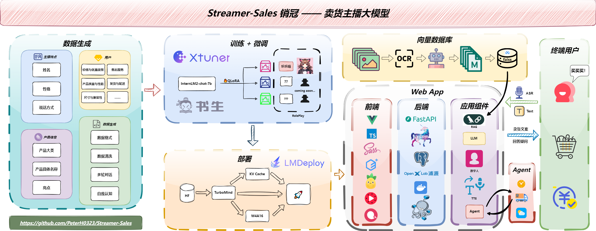

<!-- for modelscope yaml info
---
language:
- zh
tags:
- streamer-sales
- internlm2
frameworks:
- pytorch
tasks:
- text-generation
license: Apache License 2.0
---
-->
# AI-Collection-Agent - 智能电话催收机器人

<br />
<!-- PROJECT LOGO -->

<p align="center">
  <a href="https://github.com/YourUsername/AI-Collection-Agent/">
    
  </a>

<h3 align="center">AI-Collection-Agent</h3>
  <p align="center">
    <br />
    <a href="https://openxlab.org.cn/apps/detail/YourUsername/AI-Collection-Agent">查看Demo</a>
    ·
    <a href="https://github.com/YourUsername/AI-Collection-Agent/issues">报告Bug & 提出新特性</a>
  </p>
</p>

## 📢 介绍

**AI-Collection-Agent - 智能电话催收机器人** 是一个基于大型语言模型的智能催收系统。它能够根据欠款人的具体情况,生成个性化的催收话术,并通过自然语言交互进行电话催收。该系统旨在提高催收效率,同时保持专业和合规的催收方式。


**功能点总结：**

- 📜 个性化催收话术生成
- 🚀 KV cache + Turbomind 推理加速
- 📚 RAG 检索增强生成
- 🎙️ ASR 语音识别
- 🔊 TTS 文字转语音输出
- 🌐 Agent 查询欠款信息

这个智能催收系统不仅能提高催收效率,还能确保催收过程的合规性和专业性。它可以根据欠款人的具体情况调整催收策略,提高催收成功率。

后续我们将继续优化模型,使其能够更好地理解和回应欠款人的各种情况,并实时调整催收策略。


## 🎉 NEWS

- [2024.10.24] demo v1.0 制作完成

<!-- 保留原有的其他部分,如目录、架构图、演示、Model Zoo等 -->

## 🧭 详细指南

本指南会从以下几点进行说明：

1. [环境搭建](#一环境搭建)
2. [微调数据集准备](#二微调数据集准备)
3. [训练](#三训练)
4. [催收策略生成](#四催收策略生成)
5. [RAG向量数据库](#五RAG向量数据库)
6. [部署](#六部署)
7. [如何添加欠款人信息](#七如何添加欠款人信息)


## 🛠 架构图




## 🎨 快速体验

**在线体验地址**：xxx

or 

**本地**：

```bash
streamlit run app.py --server.address=0.0.0.0 --server.port 7860
```


## 🧱 开发计划

- [ ] 支持多种角色
- [x] 模型推理加速
- [x] 接入 RAG 
- [x] TTS 生成语音
- [x] 接入 Agent
- [x] ASR 语音识别

## 🧭 详细指南

本指南会从以下几点进行说明：

1. [环境搭建](#一环境搭建)
2. [微调数据集准备](#二微调数据集准备)
3. [训练](#三训练)
4. [说明书生成](#四说明书生成)
5. [RAG向量数据库](#五RAG向量数据库)
6. [部署](#六部署)

### 一、环境搭建


### 二、微调数据集准备

### ...


## 📧 后记


